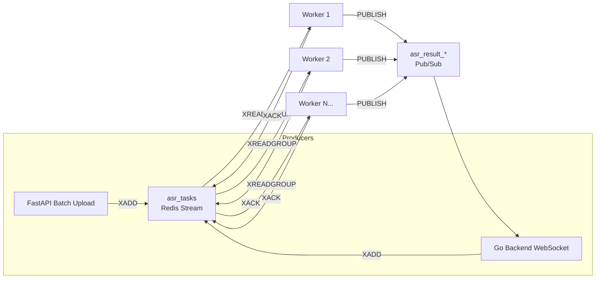

# Redis Streams Architecture

> **Language**: [English](ARCHITECTURE_STREAMS.en.md) | [简体中文](ARCHITECTURE_STREAMS.zh-CN.md)

> Unified ASR_server (Python) and ASR_go_backend (Go) High Concurrency Task Processing Architecture

## Why Redis Streams?

| Feature | RQ (Before) | Redis Streams (After) |
|---------|------------|----------------------|
| Message Persistence | Job stored until processed | Messages persist in stream |
| Consumer Scaling | Manual worker scaling | Consumer Groups auto-balance |
| Failure Recovery | Failed job in registry | Pending messages reclaimable |
| Cross-language | Python only | Any language with Redis client |
| Monitoring | rq-dashboard | XINFO, XPENDING built-in |

## Architecture



## Message Schema

All tasks use unified JSON format:

```json
{
  "type": "batch | stream",
  "task_id": "uuid-or-session-id",
  "payload": {
    // batch: {"audio_path": "/path/to/file.wav", "language": "zh"}
    // stream: {"chunk_index": 5, "audio_data": "base64..."}
  },
  "timestamp": 1702345678000,
  "origin": "fastapi | go-backend"
}
```

## Consumer Group Configuration

**Stream Name:** `asr_tasks`  
**Consumer Group:** `asr_workers`

```bash
# Create group (auto-created by workers)
redis-cli XGROUP CREATE asr_tasks asr_workers $ MKSTREAM

# View group info
redis-cli XINFO GROUPS asr_tasks
```

## Monitoring Commands

```bash
# Stream overview
redis-cli XINFO STREAM asr_tasks

# Pending messages (unacknowledged)
redis-cli XPENDING asr_tasks asr_workers

# Consumer list and pending counts
redis-cli XINFO CONSUMERS asr_tasks asr_workers

# Stream length
redis-cli XLEN asr_tasks
```

## Failure Recovery

### Idle Message Claiming

Workers automatically claim messages from dead workers:

```python
# In unified_worker.py - XAUTOCLAIM
streams_client.claim_stale_messages(
    worker_name="worker-2",
    min_idle_ms=60000,  # 1 minute idle
    count=10
)
```

### Manual Recovery

```bash
# List pending messages with idle time
redis-cli XPENDING asr_tasks asr_workers - + 10

# Claim specific message
redis-cli XCLAIM asr_tasks asr_workers worker-2 60000 1702345678000-0
```

## Performance Tuning

| Parameter | Default | Description |
|-----------|---------|-------------|
| `WORKER_COUNT` | 2 | Number of workers per instance |
| `batch_size` | 5 | Messages per XREADGROUP |
| `block_ms` | 1000 | Blocking timeout (ms) |
| `min_idle_ms` | 60000 | Idle time before claiming |

## Startup

```bash
# Start unified workers
./scripts/start_unified_worker.sh

# Or with custom settings
WORKER_COUNT=4 STREAM_NAME=asr_tasks ./scripts/start_unified_worker.sh
```
