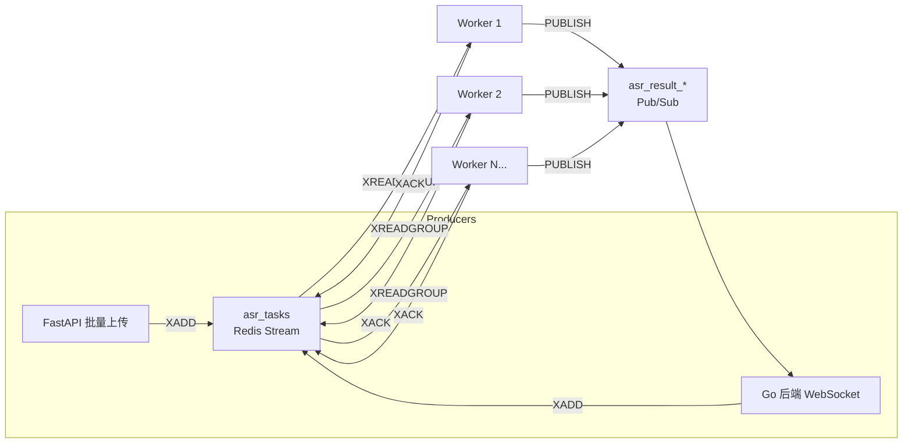

# Redis Streams 架构设计

> **语言**: [English](ARCHITECTURE_STREAMS.en.md) | [简体中文](ARCHITECTURE_STREAMS.zh-CN.md)

> 统一 ASR_server (Python) 和 ASR_go_backend (Go) 的高并发任务处理架构

## 为什么选择 Redis Streams?

| 特性 | RQ (旧版) | Redis Streams (新版) |
|---|---|---|
| 消息持久化 | 任务存储直到被处理 | 消息在流中持久化 |
| 消费者扩展 | 手动扩展 Worker | 消费者组 (Consumer Groups) 自动负载均衡 |
| 故障恢复 | 失败任务在注册表中 | Pending 消息可被回收 (Reclaimable) |
| 跨语言 | 仅限 Python | 任何支持 Redis 客户端的语言 |
| 监控 | rq-dashboard | 内置 XINFO, XPENDING |

## 架构



## 消息格式 (Schema)

所有任务使用统一的 JSON 格式:

```json
{
  "type": "batch | stream",
  "task_id": "uuid-or-session-id",
  "payload": {
    // batch: {"audio_path": "/path/to/file.wav", "language": "zh"}
    // stream: {"chunk_index": 5, "audio_data": "base64..."}
  },
  "timestamp": 1702345678000,
  "origin": "fastapi | go-backend"
}
```

## 消费者组配置

**Stream 名称:** `asr_tasks`
**消费者组:** `asr_workers`

```bash
# 创建组 (Worker 会自动创建)
redis-cli XGROUP CREATE asr_tasks asr_workers $ MKSTREAM

# 查看组信息
redis-cli XINFO GROUPS asr_tasks
```

## 监控命令

```bash
# Stream 概览
redis-cli XINFO STREAM asr_tasks

# Pending 消息 (未确认)
redis-cli XPENDING asr_tasks asr_workers

# 消费者列表及 Pending 计数
redis-cli XINFO CONSUMERS asr_tasks asr_workers

# Stream 长度
redis-cli XLEN asr_tasks
```

## 故障恢复

### 闲置消息认领 (Idle Message Claiming)

Workers 会自动认领死掉的 Worker 的消息:

```python
# In unified_worker.py - XAUTOCLAIM
streams_client.claim_stale_messages(
    worker_name="worker-2",
    min_idle_ms=60000,  # 1 分钟闲置
    count=10
)
```

### 手动恢复

```bash
# 列出 Pending 消息及其闲置时间
redis-cli XPENDING asr_tasks asr_workers - + 10

# 认领特定消息
redis-cli XCLAIM asr_tasks asr_workers worker-2 60000 1702345678000-0
```

## 性能调优

| 参数 | 默认值 | 说明 |
|---|---|---|
| `WORKER_COUNT` | 2 | 每个实例的 Worker 数量 |
| `batch_size` | 5 | 每次 XREADGROUP 获取的消息数 |
| `block_ms` | 1000 | 阻塞超时时间 (ms) |
| `min_idle_ms` | 60000 | 认领前的闲置时间 |

## 启动

```bash
# 启动统一 Workers
./scripts/start_unified_worker.sh

# 或者使用自定义设置
WORKER_COUNT=4 STREAM_NAME=asr_tasks ./scripts/start_unified_worker.sh
```
