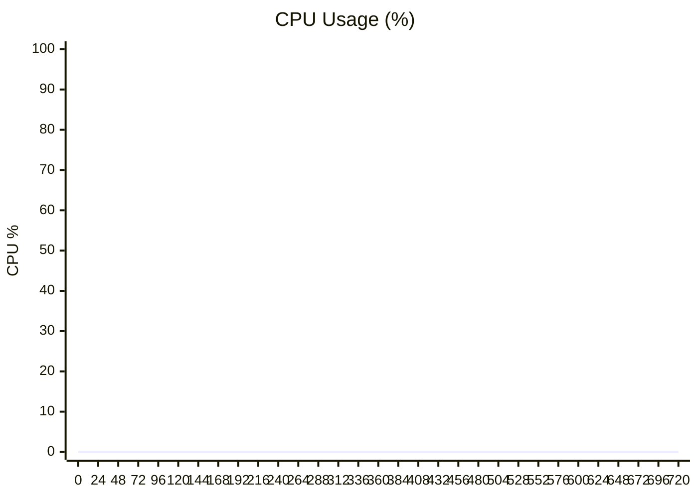

# 性能测试报告 (Performance Test Report)

> **语言切换**: [English](performance_report.md) | [简体中文](performance_report.zh-CN.md)

**音频文件:** `long_audio_test.wav`

## 性能摘要 (Performance Summary)

- **处理任务数:** 1
- **平均 RTF:** 0.164 ✅ (处理速度极快!)
- **内存峰值 (max):** 480.1 MB
- **平均内存增量 (Avg Memory Delta):** +3867.3 MB ⚠️  (增长中 Growing)

### 系统 CPU 使用率 (System CPU Usage - Python Processes)



### Worker 内存使用 (Worker Memory Usage)
```mermaid
xychart-beta
    title "Memory Peak per Task (MB)"
    x-axis ["T1"]
    y-axis "MB" 0 --> 500
    line [480.1]
```


### 处理速度率 (Real-Time Factor - RTF)
> [!NOTE]
> RTF < 1.0 意味着处理速度超过语音流速 (加速生效!)

```mermaid
xychart-beta
    title "RTF per Task"
    x-axis ["T1"]
    y-axis "RTF" 0 --> 2
    line [0.164]
```

**平均 RTF (Average RTF):** 0.164


### 文本图表 (Text-based Charts - Backup)

#### 内存峰值 (Memory Peak - MB)
```
T1: ███████████████████░ 480.1 MB
```

#### 处理速度率 (RTF)
```
T1: █░░░░░░░░░░░░░░░░░░░ 0.164
```
