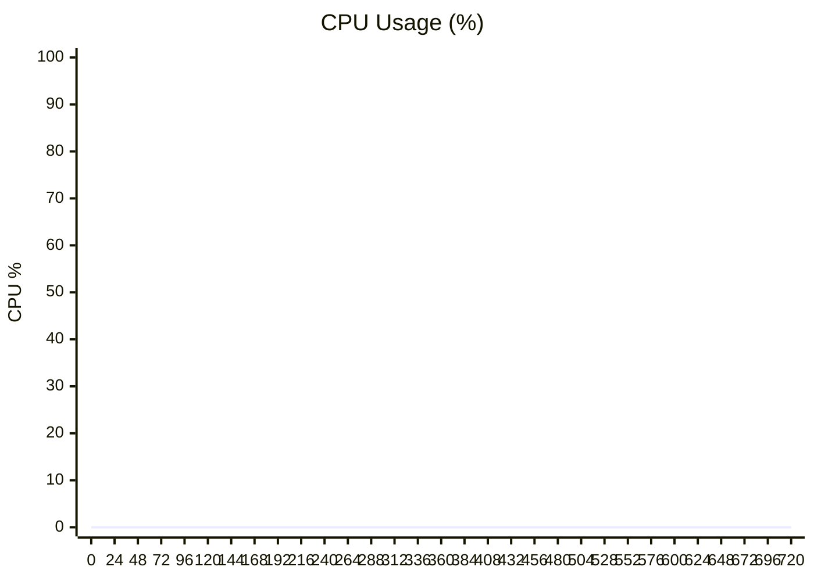

# Performance Test Report

**Audio File:** `long_audio_test.wav`

## Performance Summary

- **Tasks Processed:** 1
- **Average RTF:** 0.164 ✅ (Faster than real-time!)
- **Peak Memory (max):** 480.1 MB
- **Avg Memory Delta:** +3867.3 MB ⚠️  (Growing)

### System CPU Usage (Python Processes)



### Worker Memory Usage
```mermaid
xychart-beta
    title "Memory Peak per Task (MB)"
    x-axis ["T1"]
    y-axis "MB" 0 --> 500
    line [480.1]
```


### Real-Time Factor (RTF)
> [!NOTE]
> RTF < 1.0 means faster than real-time (acceleration working!)

```mermaid
xychart-beta
    title "RTF per Task"
    x-axis ["T1"]
    y-axis "RTF" 0 --> 2
    line [0.164]
```

**Average RTF:** 0.164


### Text-based Charts (Backup)

#### Memory Peak (MB)
```
T1: ███████████████████░ 480.1 MB
```

#### Real-Time Factor (RTF)
```
T1: █░░░░░░░░░░░░░░░░░░░ 0.164
```
