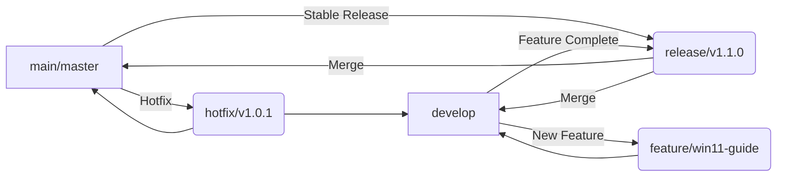

# Git Branching & Release Best Practices
# Git 分支与发版最佳实践

> **Summary / 总结**:
> *   **"Premaster"** = **`develop`** (Standard / 标准)
> *   **Pre-release Branch** = **`release/vX.X.X`** (For versioning / 用于版本发布)
> *   **Staging** = Environment Branch (For server deployment / 用于服务器部署)

---

## 1. Q&A: Release vs. Staging?
## 1. 问答：到底用 Release 还是 Staging？

You asked: *"Which one should I use as a pre-release branch: `release` or `staging`?"*
你问：*“到底是用 `release` 分支还是用 `staging` 分支作为预发布分支？”*

### The Short Answer / 简短回答
**Use `release` branches.**
**请使用 `release` 分支。**

### Detailed Comparison / 详细对比

| Feature / 特性 | **Release Branch** (`release/v1.0`) | **Staging Branch** (`staging`) |
| :--- | :--- | :--- |
| **Type / 类型** | **Temporary** (临时) | **Permanent** (永久) |
| **Lifecycle / 生命周期** | Created from `develop`, merged to `master` & deleted. <br> 从 `develop` 创建，合入 `master` 后删除。 | Always exists, mirrors the Test Server. <br> 始终存在，对应测试服务器代码。 |
| **Purpose / 目的** | **Freezing code** for a specific version (e.g., v1.0). <br> 为特定版本（如 v1.0）**冻结代码**。 | **Continuous testing** environment. <br> **持续测试**环境。 |
| **Best For / 适用场景** | Software with version numbers (App, Libs). <br> 有版本号的软件（客户端、库）。 | Web Services with a specific URL. <br> 有固定网址的 Web 服务。 |

### Why `release` is better for you / 为什么 `release` 更适合你
Your project ("3+2" Architecture) involves an Electron App and local deployment. You release **Versions** (v1.0, v1.1), not just continuous updates to a website.
你的项目（"3+2" 架构）包含 Electron 客户端和本地部署。你发布的是**版本**（v1.0, v1.1），而不仅仅是网站的持续更新。

---

## 2. Branch Naming Conventions
## 2. 分支命名规范

### ✅ `develop` (The "Premaster")
*   **Status**: ⭐⭐⭐⭐⭐ (Industry Standard / 业界标准)
*   **Definition**: The main integration branch. All new features merge here first.
*   **定义**: 主集成分支。所有新功能首先合并到这里。
*   **Role**: This is the **"premaster"** you were looking for.
*   **角色**: 这就是你想要的 **"premaster"**。

### ✅ `main` or `master` (Production)
*   **Status**: ⭐⭐⭐⭐⭐
*   **Definition**: Stable, production-ready code. Only accepts merges from `release` or `hotfix`.
*   **定义**: 稳定、可生产的代码。只接受来自 `release` 或 `hotfix` 的合并。

### ✅ `release/vX.X.X` (Preparation)
*   **Status**: ⭐⭐⭐⭐⭐
*   **Definition**: Temporary branch for final polish (bug fixes, docs) before a version release.
*   **定义**: 临时分支，用于版本发布前的最后打磨（修 Bug、写文档）。

### ❌ `premaster` (Avoid / 避免)
*   **Status**: ⭐ (Non-standard / 非标准)
*   **Reason**: Confusing to other developers. Use `develop` instead.
*   **原因**: 容易让其他开发者困惑。请使用 `develop`。

---

## 3. Recommended Workflow for KikiPounamu
## 3. 推荐工作流

We recommend the standard **Git Flow**:
我们推荐标准的 **Git Flow**：



1.  **Dev**: Work on `feature/...` branches, merge to `develop`.
    **开发**: 在 `feature/...` 分支工作，合并回 `develop`。
2.  **Prep**: When `develop` is ready, create `release/v1.0.0`.
    **准备**: 当 `develop` 准备好时，创建 `release/v1.0.0`。
3.  **Release**: Test on `release/v1.0.0`. Fix bugs. Then merge to `main` and tag it.
    **发布**: 在 `release/v1.0.0` 上测试、修 Bug。然后合并到 `main` 并打标签。

---

## 4. How to Notify Users?
## 4. 如何通知用户？

### 1. GitHub Releases (Best Practice / 最佳实践)
*   **Action**: Create a Release on GitHub linked to your Git Tag.
*   **操作**: 在 GitHub 上创建一个关联到 Git Tag 的 Release。
*   **Benefit**: Users "Watching" your repo get an email.
*   **好处**: "Watch" 你仓库的用户会收到邮件。

### 2. CHANGELOG.md
*   **Action**: Update this file for every release.
*   **操作**: 每次发布都更新此文件。
*   **Format**:
    ```markdown
    ## [1.0.0] - 2025-12-16
    ### Added
    - Windows 11 Deployment Guide
    ### Fixed
    - Startup script bug
    ```

### 3. Social Media / Community
*   **Action**: Post the GitHub Release link to Twitter/Telegram/Discord.
*   **操作**: 将 GitHub Release 链接发布到 Twitter/Telegram/Discord。

---

## 5. Versioning Strategy (Semantic Versioning)
## 5. 版本号策略 (语义化版本 SemVer)

You are currently at **v1.2**. How to choose the next number?
你现在是 **v1.2**。如何选择下一个号码？

Format: **Major.Minor.Patch** (e.g., `v1.2.1`)
格式：**主版本.次版本.修订号** (如 `v1.2.1`)

### 🟢 Patch (修订号): `v1.2.1`
*   **When**: You fixed bugs or made small tweaks (like updating docs). No new features.
*   **何时**: 你修了 Bug 或做了小调整（比如更新文档）。没有新功能。
*   **Example**: "Fixed typo in README", "Updated Win11 Guide".
*   **例子**: "修复 README 错别字", "更新 Win11 教程"。

### 🔵 Minor (次版本): `v1.3.0`
*   **When**: You added **New Features** that are backward compatible.
*   **何时**: 你加了**新功能**，且向下兼容（旧版还能用）。
*   **Example**: "Added support for MacOS", "New Settings UI".
*   **例子**: "增加 MacOS 支持", "新的设置界面"。

### 🔴 Major (主版本): `v2.0.0`
*   **When**: **Breaking Changes**. Old clients/APIs will stop working.
*   **何时**: **重大变更**。旧客户端/API 无法继续使用。
*   **Example**: "Rewrote API from REST to GraphQL", "Database schema completely changed".
*   **例子**: "API 从 REST 重写为 GraphQL", "数据库结构完全改变"。

### 💡 Recommendation for You / 给你的建议
If you are just releasing the **Windows 11 Guide** and maybe some small fixes:
如果你只是发布 **Win11 教程** 和一些小修复：

👉 **Use `v1.2.1`** (Safe & Simple / 安全且简单)
